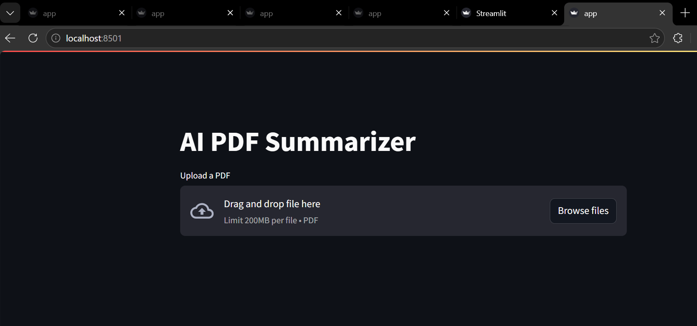
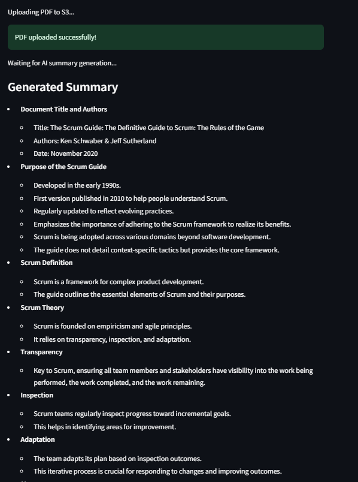

# AI PDF Summarizer

A cloud-based Generative AI application that automatically summarizes PDF documents using AWS services and Amazon Bedrock.

---

# Overview

This project allows users to upload PDF files through a Streamlit frontend. The uploaded file is stored in Amazon S3, which automatically triggers an AWS Lambda function.

The Lambda function:

- downloads the PDF
- extracts text using PyPDF2
- sends the content to Amazon Bedrock
- generates an AI summary using Amazon Nova Lite
- uploads the generated summary back to S3

The frontend then retrieves and displays the generated summary.

---

# Architecture

```text
User Uploads PDF
        ↓
Streamlit Frontend
        ↓
Amazon S3 Bucket
        ↓
S3 Event Trigger
        ↓
AWS Lambda
        ↓
PDF Text Extraction
        ↓
Amazon Bedrock (Nova Lite)
        ↓
AI Summary Generation
        ↓
Summary Stored in S3
        ↓
Frontend Displays Summary
```

---

# Features

- AI-powered PDF summarization
- Event-driven serverless workflow
- Automatic S3-triggered processing
- Streamlit-based frontend UI
- Summary download support
- Hierarchical chunk-based summarization
- CloudWatch logging for monitoring

---

# Technologies Used

- Python
- AWS Lambda
- Amazon S3
- Amazon Bedrock
- Amazon Nova Lite
- Streamlit
- PyPDF2
- AWS IAM
- CloudWatch Logs

---

# Project Structure

```text
ai-pdf-summarizer/
│
├── Backend/
│   └── lambda_function.py
│
├── frontend/
│   └── app.py
│
├── screenshots/
│
├── README.md
├── requirements.txt
└── .gitignore
```

---

# Screenshots

## Streamlit Frontend



---

## Generated AI Summary



---

# Installation

## Install dependencies

```bash
pip install -r requirements.txt
```

---

# Run Frontend

```bash
streamlit run app.py
```

---

# AWS Workflow

1. Upload PDF using Streamlit
2. File stored in S3
3. Lambda triggered automatically
4. PDF text extracted
5. Bedrock generates summary
6. Summary uploaded back to S3
7. Frontend retrieves and displays output

---

# Challenges Solved

- AWS IAM permissions
- Lambda packaging and deployment
- Bedrock model access
- Recursive S3 trigger handling
- AWS CLI configuration
- PDF parsing and summarization flow
- Streamlit AWS integration
